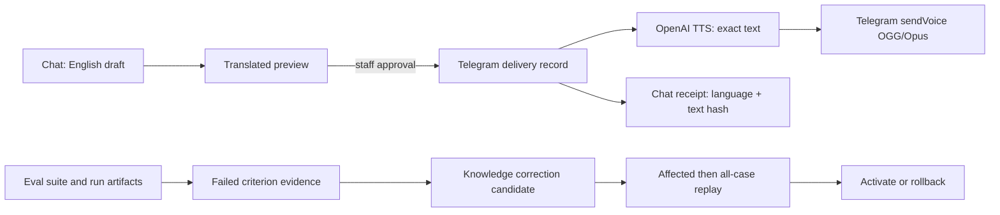

# KaunterAI MVP readiness audit

## Decision

The session spec is directionally correct and now has a lean P0 implementation path. Keep the product as three connected workbenches, not three dashboards:

1. Chat creates a reviewed patient delivery.
2. Eval makes a failure legible and opens the linked Knowledge correction.
3. Knowledge gates a candidate through replay, activation, and rollback.

The key correction to the spec: OpenAI text-to-speech has no language request field. The delivery must use the approved translated text as the audio input, then use `gpt-4o-mini-tts` instructions only to control how that exact text is spoken. Do not add a second translation step.

## What was true before this pass

- Lint, typecheck, unit tests, production build, and the Playwright suite were already broadly healthy.
- Telegram delivery already persisted approved text, SHA-256 hash, target language, TTS model, voice, part status, provider receipt, and workspace-sync state. A new delivery table or migration would have duplicated existing audit data.
- The browser Eval tests intercepted the workspace and Eval APIs. The visible UI passed, but the local E2E server intentionally returned `Eval execution is not configured` for a real `Run all cases` request. That was the most important demo-proof gap.
- The Eval and Knowledge screens had the underlying evidence and release actions, but did not surface the hierarchy at first glance.

## P0 delivered in this pass

- A live Telegram translation is a separate preview. Editing the English draft clears it; staff must approve the exact preview before a translated delivery can send.
- TTS receives that exact approved text and target language. `gpt-4o-mini-tts` receives a constrained speaking instruction; other TTS models retain their compatible request shape.
- Voice delivery messages retain a compact spoken-text hash receipt and language, backed by the existing delivery record rather than duplicating protected content in chat state.
- A shared `OperationStatus` contract and banner make Eval and Knowledge async work state consistent.
- Eval desktop/tablet now leads with active SOP version, latest suite, and failed safety criteria. Mobile keeps the primary raw-case task above the fold, so the tower is intentionally hidden there.
- Knowledge now leads with the active SOP, candidate state, release sequence, and rollback fact. Existing toolbar actions remain the only release controls.
- Telegram identity nulls render as unavailable, and the known Telegram channel label is visibly separated from staff-managed labels.
- The E2E server now runs a clearly labelled deterministic agent, judge, and correction proposer through the real workspace, Eval, and release endpoints. Eval browser tests no longer install browser API mocks.

## Architecture and relationships

The important data relationships are already present:

| Source | Relationship | Why it matters |
| --- | --- | --- |
| `telegram_deliveries` | `requestId + part` is the durable idempotency/audit key | Text and voice retry independently without changing approved content. |
| Delivery → chat message | Voice message stores `deliveryId`, source, language, and approved-text hash | Staff can verify the spoken artifact without copying raw text a second time. |
| Eval suite -> frozen Knowledge bundle | Suite snapshot pins playbook version, content hashes, agent config, and rubrics | Results remain reproducible after a later SOP edit. |
| Eval run → criteria | Judge result is stored against one suite/case/attempt | Failure evidence can open only the correction linked to that case. |
| Knowledge candidate -> replay suite | Candidate must pass affected train cases before all-case replay; the all-case replay marks it ready | Activation cannot silently follow an edit. |

No new database schema is required for P0. If persistence migrations are introduced later, preserve the current unique identity of `(request_id, part)` and the hash invariant `approved_text_hash = SHA-256(approved_text)`.

## Libraries, APIs, and deployment prerequisites

No production dependency was added. The existing stack is sufficient: React/Zustand/Zod for state and contracts, Express for APIs, Supabase for durable workspace data, OpenAI SDK for agent/judge/TTS, and Playwright/Vitest for proof.

Required deployed configuration is already in the repo:

- `LLM_API_KEY`, `LLM_BASE_URL`, `LLM_MODEL` for the configured agent, judge, correction proposer, and TTS provider credentials.
- `TTS_MODEL` defaults to `gpt-4o-mini-tts`; `TTS_VOICE` defaults to `coral`.
- `TELEGRAM_BOT_TOKEN`, `TELEGRAM_WEBHOOK_SECRET`, and `LIVE_TELEGRAM_ENABLED=true` only for the controlled live demo bot.
- `SUPABASE_URL`, `SUPABASE_SERVICE_ROLE_KEY`, and `KAUNTER_WORKSPACE_ID` for durable workspace state.

API facts verified against official docs:

- OpenAI `/v1/audio/speech` accepts up to 4096 input characters, supports `opus`, and `instructions` is available for `gpt-4o-mini-tts` only. Source: https://platform.openai.com/docs/api-reference/audio/speech-audio-done-event?lang=curl
- Telegram `sendVoice` supports OGG/Opus and returns the sent message receipt. Source: https://core.telegram.org/bots/api

## Twenty solution options considered

| # | Option | Tradeoff and decision |
| --- | --- | --- |
| 1 | Replace the draft with its translation | Fast, but edits can silently sever the voice/text identity. Rejected. |
| 2 | Keep a separate translated preview with approval | One small state object and an explicit staff step. Selected. |
| 3 | Translate again inside TTS | Adds drift and a second provider failure. Rejected. |
| 4 | Add a TTS language database field | The language already exists on the delivery record. Rejected. |
| 5 | Store a second raw spoken-text copy on the chat message | Increases protected-data duplication. Rejected. |
| 6 | Store a short spoken-text hash receipt in chat | Proves identity while keeping raw text in the delivery audit record. Selected. |
| 7 | Add a new voice-audit table | Duplicates `telegram_deliveries`. Rejected. |
| 8 | Add a TTS pre-generation endpoint for audio preview | Extra storage, cost, and stale-artifact complexity. Deferred. |
| 9 | Label TTS output as language-guaranteed | Model cannot provide that guarantee. Rejected. |
| 10 | Constrain `gpt-4o-mini-tts` to speak the exact input | Matches the provider capability and preserves text identity. Selected. |
| 11 | Build an Eval dashboard | Competes with the raw-case workbench. Rejected. |
| 12 | Add a compact Eval control tower | Surfaces SOP, latest suite, and failure criteria without moving evidence. Selected. |
| 13 | Show the tower on mobile | Pushes the first case below the viewport. Rejected after Playwright proof. |
| 14 | Build a separate Knowledge release page | Splits the edit/review/release mental model. Rejected. |
| 15 | Add a compact Knowledge release gate above the editor | Makes candidate state and rollback legible in the existing workbench. Selected. |
| 16 | Treat every label as staff-owned | Falsely claims source provenance for Telegram. Rejected. |
| 17 | Separate only known channel/system labels from staff labels | Honest within the existing label model and no migration. Selected. |
| 18 | Keep mocked browser Eval APIs | Fast but does not prove endpoint wiring. Rejected. |
| 19 | Run deterministic services inside the test server | Exercises real request contracts while clearly remaining test-only. Selected. |
| 20 | Build the public session-miner/dashboard now | Conflicts with the spec's P1 boundary and risks demo bloat. Deferred. |

## Build plan after P0

1. Configure a separate Telegram test bot and Supabase workspace. Run a controlled owner-chat smoke: translated text, TTS voice, receipt, refresh, retry, and playback.
2. Record the demo as a 3-minute story with a visible state change every 15-20 seconds: chat translation approval, delivery receipt, failed Eval criterion, Knowledge candidate, replay, and activation/rollback explanation.
3. Only if the demo loop is stable, implement P1 as a local developer command: `npm run knowledge:mine`. It should emit a local Markdown report from sanitized run/test artifacts, not a public dashboard and not clinical Knowledge data.
4. Before judging, run `npm run verify`, then repeat the browser smoke with the exact demo environment variables. Never call a deterministic test result a live provider result.

## Remaining non-blocking limits

- The E2E deterministic provider proves API integration, not live OpenAI or Telegram credentials. The controlled live smoke remains a release prerequisite.
- The current label model contains strings, not a universal provenance ledger. The UI only claims the provenance it can prove: Telegram is the channel label; other labels are staff-managed in this demo.
- DeepWiki and Context7 were not available in this environment. Existing repository patterns and official OpenAI/Telegram documentation were used instead.
