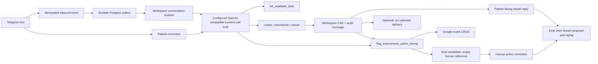

# Autonomous booking agent architecture

This is the implemented hackathon MVP architecture. It explains the autonomous Telegram booking path; it is not a production-clinic operating model.

## Product outcome

KaunterAI is a multilingual clinic front desk that can autonomously:

- reply to an inbound Telegram text message;
- find an available appointment slot;
- create and confirm an appointment;
- reschedule or cancel a confirmed appointment;
- send the response and, when configured, an `.ics` calendar file;
- record the action in the conversation; and
- turn an agent-recognized patient correction into an Eval candidate for a human-written reference.

There is no staff approval step for those administrative actions. The agent is free to choose and sequence only the capabilities supplied to it. It cannot access arbitrary records, shell commands, credentials, or clinical tools.

## Implemented flow



The model never writes the workspace directly. It selects a function, the server validates its arguments, and the function performs the committed action. A patient-facing response is sent only after the booking function has reported success.

## Data and relationships

The MVP adds no npm package. Supabase keeps the fixed workspace JSONB and adds a durable outbox,
one encrypted single-admin Google connection, and a Google event synchronization ledger.

```text
telegram_events (update id, payload hash, normalized event)
  -> outbox_jobs (one durable auto-reply job)
  -> workspace demo_state (one optimistic revision)
       -> conversations[] (one per Telegram chat, own revision)
            -> messages[] (patient, sent reply, autonomous audit)
            -> booking? (provider, slotIso, reason, status, booking revision)
       -> evalDatasets[] -> cases[] (autonomous_feedback source, human reference)
       -> playbookHistory (pinned agent evidence)
  -> telegram_deliveries (request id, provider receipt, sync status)
  -> calendar_deliveries (calendar UID, sequence, provider receipt)
  -> google_calendar_connections (one admin OAuth refresh token, encrypted)
  -> google_calendar_events (conversation -> deterministic Google event)
```

The two revisions have separate jobs:

- The workspace revision protects the JSONB document with compare-and-swap.
- The conversation revision prevents an older agent decision from acting after the patient has sent a new message.
- The booking revision supplies calendar sequence and explains appointment changes.

An autonomous mutation writes a deterministic audit message keyed by the model function-call ID. Repeating the same call returns the existing result rather than creating another appointment. A different mutation after the conversation changed is rejected as stale.

## Agent API reference

The `openai` SDK's Responses API is the preferred path. The adapter also supports OpenAI-compatible Chat Completions, but Responses preserves the function-call context with `previous_response_id` and is the demo path to use. This is the text/reasoning boundary only: inbound STT and outbound TTS can independently use OpenAI or ElevenLabs through direct provider adapters.

| Function | Input | Server assertion | Effect |
| --- | --- | --- | --- |
| `list_available_slots` | provider, local date or `null` | provider is `Dr. Farah`, `Dr. Lim`, or `Dr. Siti Rahman` | Returns deterministic demo slots, filtered through Google FreeBusy only when the admin connection is active |
| `create_booking` | provider, returned ISO slot, reason | conversation is current; no confirmed booking; slot is still free | Saves an approved booking |
| `reschedule_booking` | provider, returned ISO slot, reason | conversation is current; booking is approved; slot is still free | Changes the approved booking |
| `cancel_booking` | no arguments | conversation is current; booking is approved | Cancels the booking |
| `flag_autonomous_action_wrong` | concise reason | conversation has patient input; server creates a bounded Eval candidate | Adds a `autonomous_feedback` candidate with no reference answer |

Every function result follows a bounded envelope. Success returns `success: true` and the current booking or slots. Failure returns `success: false`, `error_type`, `message`, and a recovery suggestion. The model receives that result before it writes the patient reply.

## Dependencies and configuration

No dependency was added for this feature. The MVP uses the repository's existing stack:

| Layer | Existing dependency / service | Purpose |
| --- | --- | --- |
| Agent reasoning and tools | `openai` 6.x | Structured final output and function-call loop |
| Input and tool validation | `zod` 4.x | Strict request, provider, and booking arguments |
| Webhook/API | Express 5 | Telegram ingress and delivery endpoints |
| Durable state | Supabase Postgres | Workspace CAS, inbound-event/delivery records, outbox, and optional Google sync ledger |
| Calendar | Native `fetch` + Google Calendar API | Optional single-admin FreeBusy plus event create/update/delete; `ical-generator` still makes the Telegram invite |
| UI | React 19 | Shows the manual-run autonomous action trace |

Required live path switches remain `LIVE_TELEGRAM_ENABLED=true` and `LIVE_AGENT_ENABLED=true`, plus the existing Supabase, Telegram, and `LLM_*` values. The local suite proves the complete contract with deterministic providers; a real inbound Telegram-to-model-to-receipt smoke still requires a user-controlled test chat.

## Feedback and learning loop

The model decides semantically from the supplied conversation whether the patient is saying the
agent got something wrong. It has no regex, keyword, or client-side button trigger. When it calls
`flag_autonomous_action_wrong`, the server creates an `autonomous_feedback` Eval case containing
the patient messages and the model's concise reason. The case intentionally has an empty expected
human output, so it cannot run in Eval until a human supplies the correction. The human response is
the hidden reference; the autonomous response is never allowed to grade itself. Dream can then
propose and replay an immutable playbook correction before activation.

The agent does not rewrite its own system prompt from a single message: that would turn untrusted
feedback into a prompt-injection path. The feedback function is a learning signal, not a policy
mutation.

This is deliberate autonomy: the agent acts immediately in its permitted workflow, while changes to the policy that governs every future patient still use the existing Eval and Dream release gate.

## Tradeoffs considered

These are the 20 candidate approaches considered for autonomous booking. The selected approach is the smallest combination that produces a real agentic demo without inventing a new scheduling platform.

| # | Approach | Decision and reason |
| ---: | --- | --- |
| 1 | Staff approves every booking | Rejected: removes the autonomy demo. |
| 2 | Model returns a draft only | Rejected: already existed and does not act. |
| 3 | Model writes JSONB directly | Rejected: no validation, audit, or CAS boundary. |
| 4 | One overloaded `manage_booking` tool | Rejected: unclear action semantics and weak evaluation. |
| 5 | Four atomic booking tools | Selected: clear authority and exact test cases. |
| 6 | Add a full EHR integration now | Deferred: large, clinic-specific, not needed for the demo. |
| 7 | Add optional Google Calendar availability | Selected after the core demo: one admin OAuth connection filters the existing candidate slots without replacing the fallback scheduler. |
| 8 | Use a deterministic in-app availability grid | Selected: real state mutation without a new dependency. |
| 9 | Let the model invent a slot | Rejected: causes false confirmations. |
| 10 | Let the model choose only returned slots | Selected: server rechecks availability at commit time. |
| 11 | Ask a human after every tool call | Rejected: recreates the staff gate. |
| 12 | Give the model arbitrary database access | Rejected: violates least authority and is hard to audit. |
| 13 | Let the model send raw Telegram requests | Rejected: bypasses idempotent delivery records. |
| 14 | Server-owned Telegram delivery after the final reply | Selected: preserves delivery idempotency and message sync. |
| 15 | Retry a timed-out external send blindly | Rejected: can duplicate a real patient message. |
| 16 | Retry workspace CAS conflicts from fresh state | Selected: safe, bounded, and preserves patient recency. |
| 17 | Persist a narrow job outbox | Selected: two typed jobs make automatic replies and calendar synchronization recoverable without Redis or a second service. |
| 18 | Let feedback mutate the prompt automatically | Rejected: feedback can be malicious or unrepresentative. |
| 19 | Send feedback through Eval and Dream | Selected: learns from evidence while retaining agent release control. |
| 20 | Add multi-agent orchestration | Deferred: one reliable autonomous agent is more persuasive than simulated complexity. |

## Known boundary

This is a working autonomous booking MVP, not authorization, tenancy, consent management, EHR/PMS authority, multi-calendar scheduling, or a real-clinic safety certification. A real owner-controlled provider smoke remains required before public use with patient data.
