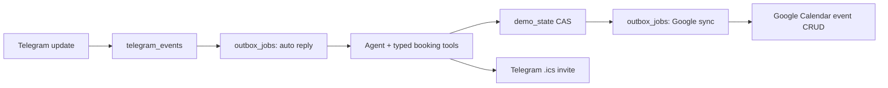

# Durable replies and optional Google Calendar

This is the implemented hackathon architecture, not a clinic-management system. It adds no npm
package: Node 22 `fetch` and `crypto`, Supabase Postgres, and the existing Express app are enough.

## Behavior

- With no Google configuration or no completed admin connection, booking tools use the existing
  deterministic demo slots. No Google request is made.
- With one completed Google connection, `list_available_slots` filters those same candidate slots
  through Google Calendar FreeBusy. Booking create, reschedule, cancellation, and persisted
  Telegram Schedule edits enqueue event synchronization. Synthetic fixture bookings never leave
  the demo workspace.
- An event ID is deterministic per conversation, so a retry updates the same Google event. The
  app writes the event on create/reschedule and deletes it on cancel. The existing `.ics` Telegram
  delivery is independent and still works in demo-fallback mode.
- The Telegram webhook persists an inbound update first, then the database trigger creates an
  outbox job in the same transaction as `telegram_events.status = processed`. The webhook may
  return success immediately; a worker claims that job, retries bounded failures, and recovers a
  stale running claim after five minutes. Completion and retry are fenced by that claim timestamp,
  so an expired worker cannot finalize a newer worker's lease.
- If a Google sync job reached a terminal failure, completing Google consent again reactivates that
  same booking revision rather than silently leaving it stranded.



## Schema relationships

| Record | Relationship | Purpose |
| --- | --- | --- |
| `demo_state` | One fixed workspace JSONB -> many conversations -> optional booking | Server-authoritative booking state and CAS revision. |
| `telegram_events.normalized_event` | One Telegram update -> one durable auto-reply payload | Lets the database trigger enqueue without relying on process memory. |
| `outbox_jobs` | One dedupe key per workspace + job type | Durable `telegram_auto_reply` and `google_calendar_sync` work. |
| `google_calendar_connections` | One workspace -> one admin OAuth refresh token | Stores encrypted token, selected calendar, granted scope, and connection state. |
| `google_calendar_events` | One workspace conversation -> one deterministic Google event | Sync ledger: event ID, booking revision, ETag, and active/cancelled state. |

All new tables have RLS enabled, revoke `anon` and `authenticated`, and grant only `service_role`.
The queue RPCs and trigger functions are revoked from public roles as well.
The browser never receives the Supabase service-role key, OAuth client secret, admin token, or
refresh token.

## Google setup

### Production values

`KAUNTER_WORKSPACE_ID` is the exact workspace row used by Supabase. Keep `demo` when deploying
the fixed demo workspace; change it only if production uses a different seeded workspace ID.

`CALENDAR_UID_DOMAIN` is not a web link. It is the stable domain namespace embedded in `.ics`
event UIDs. `calendar.kaunterai.test` is suitable for local/test use only. In production use a
stable domain you control, for example `calendar.example.com`, and keep it unchanged after events
have been sent.

`GOOGLE_CALENDAR_REDIRECT_URI` is the real public HTTPS app URL plus
`/api/admin/calendar/google/callback`, for example
`https://app.example.com/api/admin/calendar/google/callback`. Register that exact value in Google
Cloud; the placeholder `YOUR_APP_DOMAIN` below is not a value to deploy.

1. In Google Cloud, enable **Google Calendar API** and create an OAuth **Web application** client.
2. Add this exact authorized redirect URI:
   `https://YOUR_APP_DOMAIN/api/admin/calendar/google/callback`.
3. Generate a 32-byte encryption key once:

   ```powershell
   node -e "console.log(require('node:crypto').randomBytes(32).toString('base64url'))"
   ```

4. In DigitalOcean App Platform, add these as encrypted **RUN_TIME** variables. Never commit them:

   ```text
   GOOGLE_CALENDAR_ENABLED=true
   GOOGLE_CALENDAR_ADMIN_TOKEN=<24+ random characters>
   GOOGLE_CALENDAR_CLIENT_ID=<Google OAuth client ID>
   GOOGLE_CALENDAR_CLIENT_SECRET=<Google OAuth client secret>
   GOOGLE_CALENDAR_REDIRECT_URI=https://YOUR_APP_DOMAIN/api/admin/calendar/google/callback
   GOOGLE_CALENDAR_ID=primary
   GOOGLE_CALENDAR_TOKEN_ENCRYPTION_KEY=<32-byte base64url value>
   GOOGLE_CALENDAR_TIME_ZONE=Asia/Kuala_Lumpur
   ```

5. Deploy, then start consent from an administrator shell without putting the admin token in a URL:

   ```powershell
   $headers = @{ "x-kaunter-admin-token" = $env:GOOGLE_CALENDAR_ADMIN_TOKEN }
   $reply = Invoke-RestMethod -Method Post -Headers $headers `
     -Uri "https://YOUR_APP_DOMAIN/api/admin/calendar/google/connect"
   Start-Process $reply.authorizationUrl
   ```

6. Approve consent in the system browser. The callback queues existing persisted bookings and the
   worker synchronizes them. Verify the in-app Schedule badge reads **Google Calendar synced**.

Google's web-server OAuth flow requires `access_type=offline` for a refresh token. The requested
scopes are `calendar.events.owned` and `calendar.events.freebusy`; they are sufficient for this
single-admin calendar use case. See Google’s [web-server OAuth guide](https://developers.google.com/identity/protocols/oauth2/web-server), [FreeBusy reference](https://developers.google.com/workspace/calendar/api/v3/reference/freebusy/query), and [Events reference](https://developers.google.com/workspace/calendar/api/v3/reference/events).

## Verification boundary

Automated tests cover demo fallback, FreeBusy filtering (including Schedule edits), event
create/delete, stale booking revisions, synthetic-fixture exclusion, migration access rules,
reconnect requeue contract, and fenced outbox retry state with mocked providers. A real Google
consent, calendar event, Telegram message, `.ics` document, and DigitalOcean deploy must still be
smoke tested by the administrator because this repository cannot use their credentials.
