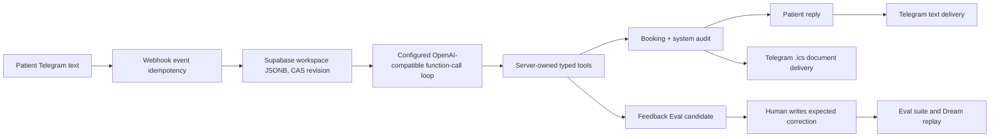

# Hackathon autonomy MVP plan

This is a demo of a capable autonomous front desk, not a real-clinic deployment. The smallest
winning story is: **a patient sends a Malay voice note, the agent transcribes and understands it,
checks the demo schedule, books it, sends concise text plus a voice confirmation and a calendar
invitation, shows every action, then converts a patient correction into a measurable learning
candidate.**

## Priority order

| Rank | Deliverable | Why it comes now | Status |
| ---: | --- | --- | --- |
| 1 | Complete Telegram voice booking: voice -> transcript/gloss -> availability -> booking -> concise text + TTS voice -> `.ics` -> action trace | This is the irreplaceable autonomous-agent moment. | Implemented and covered by deterministic server tests; direct ElevenLabs STT/TTS is configurable. |
| 2 | Remove Approve / Reject booking controls | A staff gate contradicts the story in the first five seconds. | Implemented. |
| 3 | Visible booking timeline | Lets a judge understand the state transition at a glance. | Implemented. |
| 4 | Agent-owned wrong-action feedback tool -> Eval candidate | Shows the agent can notice its own failure and make it measurable. | Implemented; a human must add the reference correction. |
| 5 | Real Telegram smoke with an owner-controlled chat | Converts local proof into a credible deployment proof. | Requires the owner to send the inbound message. |
| 6 | Demo choreography and screenshots | Ensures a distinct proof point at least every 20 seconds. | Ready after live smoke. |

Do not spend hackathon time on Google/Outlook OAuth, a clinic PMS, a new scheduler, a durable job
queue or authentication. Those are useful production work but dilute the demo and are not needed
to prove tool-using autonomy.

## What is true now

| Area | Verified locally | Still not proven or intentionally deferred |
| --- | --- | --- |
| Agent reply | The agent service accepts structured output and bounded function-call rounds. | Real model quality, cost, and rate limits need a live owner test. |
| Booking | The server lists deterministic demo slots, rechecks a chosen slot at mutation time, writes an audit message, and suppresses duplicate function calls. | It is not an external clinic, calendar, or PMS authority. |
| Calendar | Create/reschedule constructs an RFC 5545 `.ics` attachment and the Telegram path has an idempotent document-delivery record. | It does not create a Google or Outlook event; a fresh real receipt needs a test chat. |
| UI | The patient rail has no Approve/Reject gate and renders Requested -> Availability checked -> Confirmed/Rescheduled/Cancelled. Manual runs render the action trace. The inbox polls every 8 seconds and refreshes immediately when the browser regains focus or visibility. | Sub-second server push from Telegram remains deferred. |
| Eval progress | A suite shows `Replaying <case> / <n> of <total>`, marks the active row, disables competing actions, and exposes Cancel. | The output is deterministic in local tests; a live judge run is optional demo proof, not needed for the booking story. |
| Feedback | The model can call `flag_autonomous_action_wrong`; the server creates an `autonomous_feedback` Eval case once. | A human must write the expected answer before Eval/Dream can use it. |
| Delivery | Text and calendar sends use idempotency records. | The post-webhook agent work is background work, so a process crash can lose an in-flight reply. |
| Voice | A persisted inbound voice note is transcribed, glossed for staff, run through the agent, and answered with concise text plus AI TTS voice. OpenAI remains the default; direct ElevenLabs Scribe v2/STT and TTS can be selected independently. | Live provider quality, credentials, and crash recovery need an owner-controlled smoke test. |

## Minimal architecture and data contract

No new table or package is needed. The existing Supabase workspace JSONB contains the user-facing
domain state; side records make external Telegram operations idempotent.

| Record / field | Relationship | Why it exists |
| --- | --- | --- |
| `telegram_events` | one inbound update -> one payload hash | Ignore retried webhook updates. |
| workspace `demo_state` | one CAS-protected document -> many conversations | Keep the existing fixed demo workspace durable. |
| conversation `revision` | one conversation -> messages and optional booking | Reject an action based on stale patient context. |
| booking `calendar_uid`, `calendar_sequence`, `status` | one confirmed booking -> calendar delivery | Preserve event identity across reschedules/cancels. |
| system audit message | one completed tool-call ID -> one recorded action | Make tool effects visible and replay-safe. |
| `telegram_deliveries` / `calendar_deliveries` | one outgoing request -> provider receipt | Prevent duplicate patient messages/documents. |
| Eval case `source.kind = autonomous_feedback` | one feedback tool call -> one candidate | Preserve the patient feedback and reason without changing policy. |

The key server boundary is: the model chooses only a declared function and JSON arguments; Zod
validates them; the server alone reads/writes the workspace and sends Telegram. Function-call IDs
and CAS revisions provide duplicate and stale-decision protection.

## Dependencies, APIs, and configuration

Use the repository's existing dependencies only:

| Layer | Existing dependency / API | MVP use |
| --- | --- | --- |
| Reasoning | `openai` Responses API (with compatible Chat Completions adapter) | Structured final reply and function calls; can point at a proven OpenAI-compatible provider. |
| Validation | `zod` | Strict model result and function argument schemas. |
| State | `@supabase/supabase-js` / Postgres | Workspace CAS and Telegram delivery/event records. |
| Telegram | Bot API `setWebhook`, inbound updates, `sendMessage`, `sendDocument` | Chat ingress, text reply, `.ics` delivery. |
| Calendar file | `ical-generator` / RFC 5545 | Add-to-calendar attachment, not provider OAuth. |
| Voice | Direct OpenAI or ElevenLabs REST API via native `fetch` | Provider-selected STT/TTS without an SDK or a second agent loop. |
| App | Express 5, React 19, Vite | Webhook/API and demo UI. |

The live demo needs the already-defined `LLM_*`, Supabase, and Telegram settings plus
`LIVE_AGENT_ENABLED=true` and `LIVE_TELEGRAM_ENABLED=true`. For ElevenLabs voice, set
`SPEECH_PROVIDER=elevenlabs` and/or `TTS_PROVIDER=elevenlabs`, then provide the matching
`ELEVENLABS_*` variables. Do not add Google Calendar or Outlook credentials for this MVP: the
`.ics` file is enough to visibly prove the appointment outcome.

## Wrong-action feedback: 20 options and the selected combination

The problem is turning “what are you doing?” into learning evidence without pretending every
negative sentence is an agent failure or letting a patient rewrite production policy.

| # | Option | Decision, tradeoff, and fit |
| ---: | --- | --- |
| 1 | Regex for `wrong`, `wtf`, or `bug` | Reject: brittle across languages and easily false-positive. |
| 2 | Client-side “flag” button only | Reject: hides the agentic decision the demo needs. |
| 3 | Model function call from full conversation | **Select:** semantic, multilingual, visible tool use. |
| 4 | Separate classifier model | Defer: added cost, latency, and calibration work. |
| 5 | Let the reply model change a booking directly from any complaint | Reject: complaint detection is not booking authority. |
| 6 | Store the complaint as a system message only | Reject: not measurable in Eval. |
| 7 | Create an Eval candidate with empty expected output | **Select:** preserves evidence and forces human correction. |
| 8 | Use the patient complaint itself as expected output | Reject: it cannot serve as a correct reference answer. |
| 9 | Auto-write the expected answer with the same model | Reject: self-grading masks the failure. |
| 10 | Auto-edit the system prompt | Reject: one untrusted message would mutate global policy. |
| 11 | Auto-edit an SOP | Reject: bypasses versioning, Eval, Dream, and rollback. |
| 12 | Route every complaint to staff handoff | Defer: useful clinically, but weakens ordinary admin autonomy. |
| 13 | Make a dedicated feedback dataset | Defer: extra UI and migration; source kind is enough now. |
| 14 | Add a conversation label plus audit entry | **Select:** gives the demo visible provenance cheaply. |
| 15 | Require a second confirmation before flagging | Reject: adds a gate and loses the immediate wow moment. |
| 16 | Let the model flag every correction request | Reject: ordinary reschedules and preferences are not defects. |
| 17 | Prompt the model to reason semantically, once | **Select:** preserves discretion and prevents duplicate candidates. |
| 18 | Deduplicate by tool-call ID | **Select:** safe replay under provider/webhook retries. |
| 19 | Block Eval runs until a human reference exists | **Select:** makes the missing correction explicit instead of producing fake scores. |
| 20 | Feed approved cases through Eval then Dream | **Select:** connects the failure signal to the existing governed learning loop. |

This combination is deliberately small: one typed tool, one existing Eval source variant, no new
service, no new database table, and no automatic policy mutation.

## Verification and live smoke order

1. Run unit, type, lint, production build, and browser E2E from a clean dependency install.
2. Confirm the staged demo with a deterministic function-calling provider: availability -> create
   -> audit -> reply -> calendar delivery handoff, then feedback -> empty-reference Eval candidate.
3. Read Telegram `getMe` and `getWebhookInfo` without sending a message; this verifies configuration
   but not end-to-end behavior.
4. From an owner-controlled Telegram chat, send: “Can I book Dr. Farah at 10am tomorrow?” Verify
   the reply, action trace/timeline, booking state, and `.ics` receipt. Then reply in natural
   language that the action was wrong and verify the Eval candidate appears with a human-correction
   requirement.
5. Capture a short screen recording. Every 20 seconds show a distinct proof: multilingual intent,
   tool trace, confirmed timeline/calendar, wrong-action flag, then the Eval candidate.

### 60-second demo choreography

- 0:00-0:20: Send one concise Malay voice note; show the detected language, transcript, and English gloss.
- 0:20-0:40: Let the agent check availability and book; keep the action trace visible while the timeline advances.
- 0:40-1:00: Show the short text reply, matching TTS voice reply, and `.ics` delivery receipt; if voice fails, show text preserved and retry only voice.
- 1:00-1:20: Send a correction; show the agent flag the wrong action and route the case to Eval with a human-reference requirement.

Do not send an unsolicited live Telegram message: the bot owner should initiate the test from the
known chat so the audience and consequence are explicit.

## Post-hackathon backlog

Only after the demo lands: durable outbox/worker, real scheduling authority, external calendar
OAuth, tenant/auth boundaries, notification retry policy, and live UI updates. They
are production concerns, not blockers for a truthful hackathon demo.
